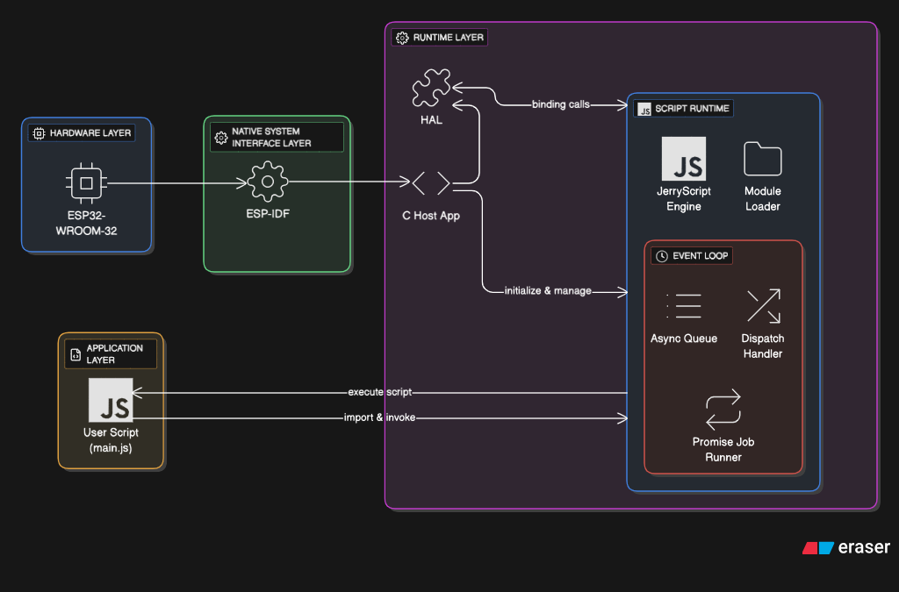
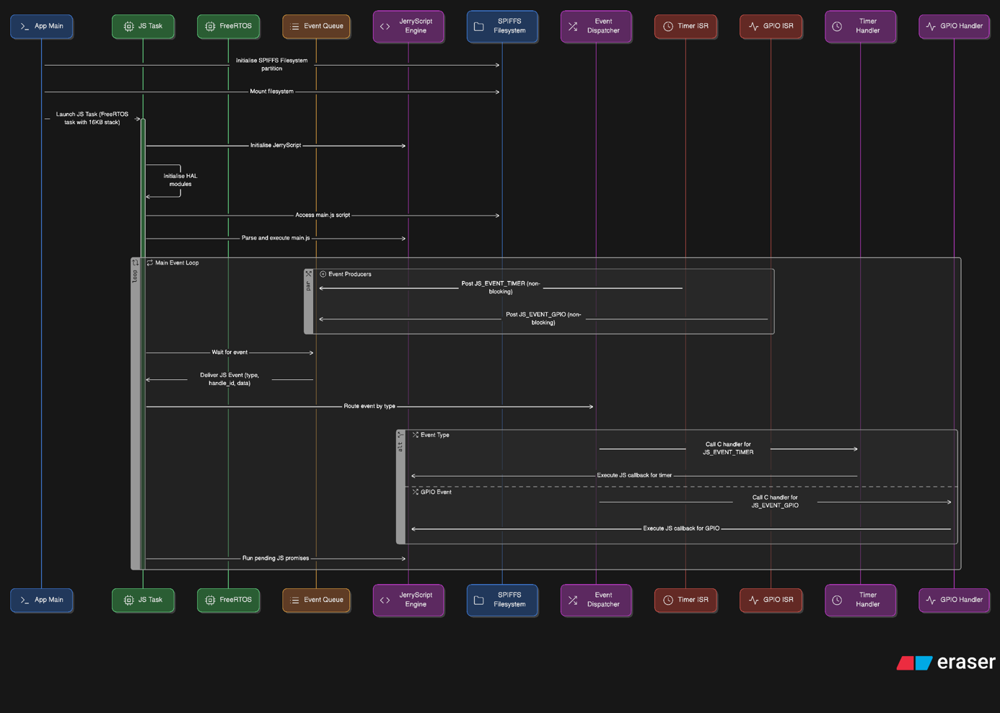
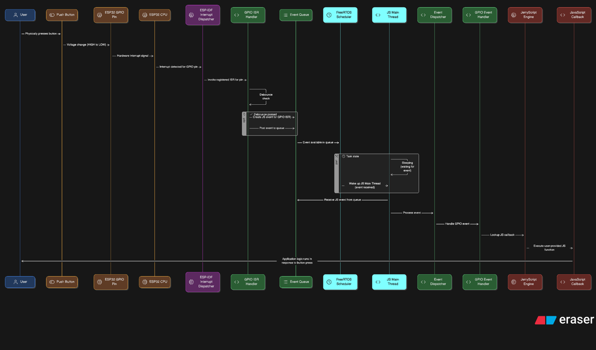
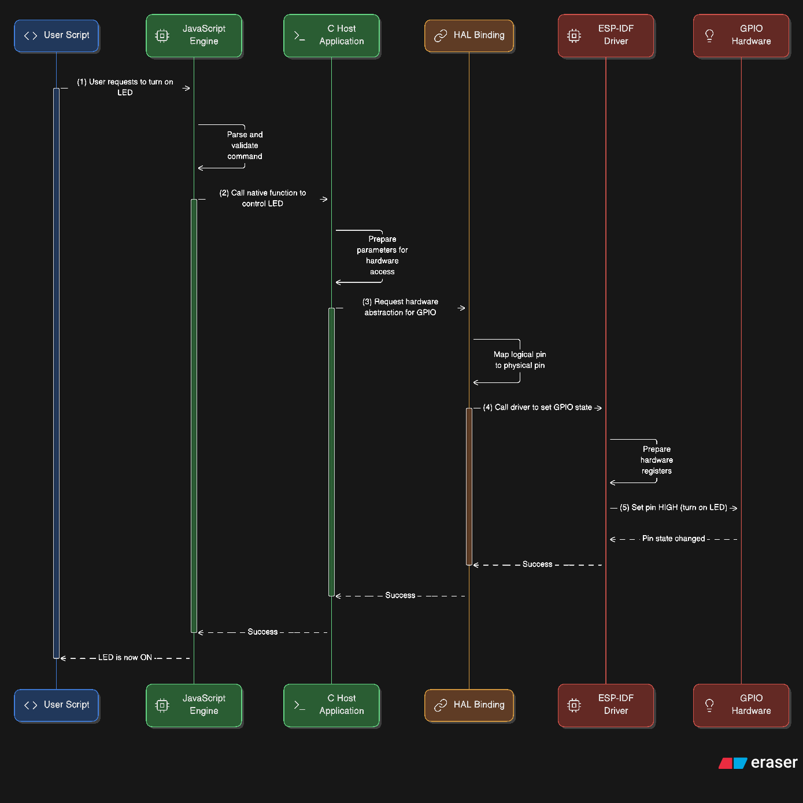
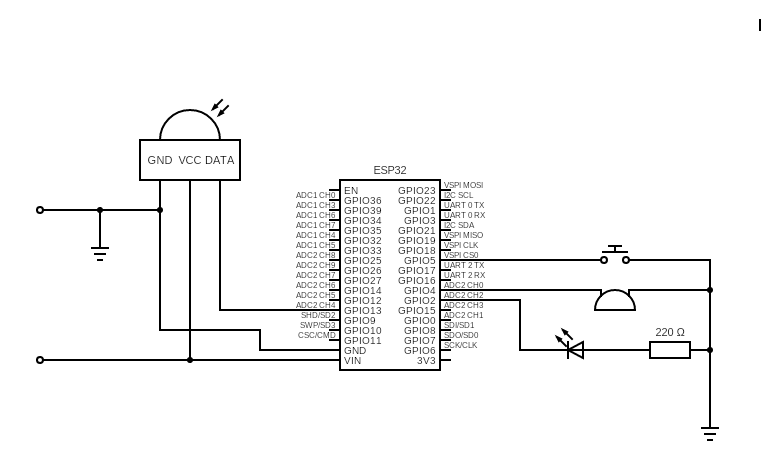
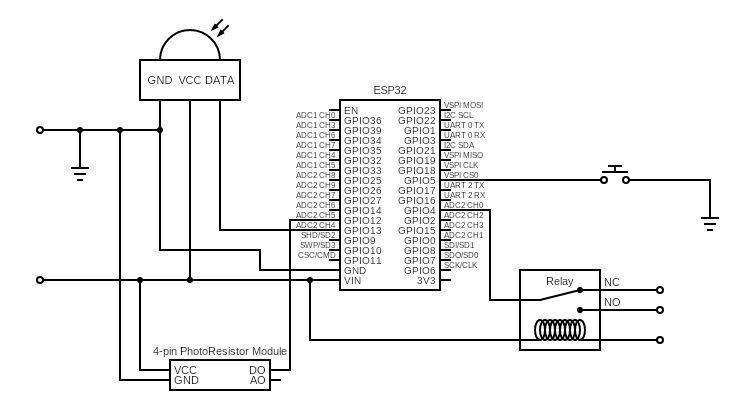
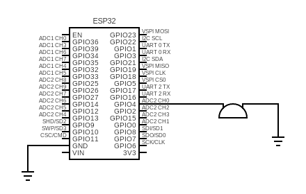

# JavaScript Runtime for ESP32

A lightweight, event-driven JavaScript runtime for the ESP32. It embeds the [JerryScript](https://github.com/jerryscript-project/jerryscript) engine into an ESP-IDF project and exposes hardware to scripts through familiar, Node/browser-style APIs: ES modules, `setTimeout`/`setInterval`, Promises and `async`/`await`, and GPIO with interrupt callbacks.

Built as a final-year project in Software Engineering (Lead City University, 2025). The goal was to lower the barrier to IoT prototyping: write a `main.js`, flash it, and react to hardware events without writing C.

```js
import { setup } from "gpio";

const led = setup(2, { mode: "output" });
const button = setup(5, { mode: "input", pullMode: "pullup", interrupt: "falling" });

let on = false;
button.attachISR(() => {
  on = !on;
  led.write(on);
  console.log("LED", on ? "on" : "off");
});
```

## Features

- **JerryScript engine** built from a pinned submodule for the ESP32 (`es.next` profile, module system enabled, 64 KB script heap)
- **Event-driven core:** interrupts and timers post events to a FreeRTOS queue; a dedicated JS task dispatches them, so user code never runs in interrupt context
- **ES6 modules:** import native C modules (`gpio`, `timers`, `console`) or `.js` files stored on the device
- **Promises and `async`/`await`:** the event loop drains JerryScript's job queue after every event
- **Timers:** `setTimeout`, `setInterval`, `clearTimeout`, `clearInterval`, backed by `esp_timer`
- **GPIO:** input/output, pull modes, edge and level interrupts, per-pin debounce option (see [Known issues](#known-issues)), pin cleanup tied to the JS object's lifecycle
- **TypeScript declarations** for editor autocomplete (`types/gpio.d.ts`)

## Architecture

The runtime is organised into four layers: the hardware, the ESP-IDF drivers that talk to it, the C runtime (JerryScript engine, module loader, HAL bindings and event loop), and the JavaScript application on top.



**Async event flow (e.g. a button press):**

1. The pin interrupt fires and the ISR runs a short handler (marked `IRAM_ATTR`).
2. The ISR posts a `js_event_t` to the queue with `xQueueSendFromISR`.
3. The JS task, blocked on the queue, wakes and dispatches the event.
4. The runtime looks up the stored JS callback and calls it with `jerry_call`.
5. The loop runs pending Promise jobs, then blocks again.

Timers follow the same path: the `esp_timer` callback (ISR dispatch) only posts an event.

The full startup sequence and main loop:



<details>
<summary>Sequence diagrams: a button press reaching a JS callback, and a JS call reaching hardware</summary>

**Asynchronous (bottom-up): hardware event to JS callback**



**Synchronous (top-down): JS call to hardware action**



</details>

**Components**

| Component | Responsibility |
|---|---|
| `main/` | Mounts the SPIFFS partition and starts the JS task (16 KB stack, priority 10, pinned to core 1) |
| `components/js_main_thread` | Event queue, event loop, timer list, GPIO state and ISR handling |
| `components/js_std_lib` | Native module registry and the C bindings for `gpio`, `timers`, `console` |
| `components/js_module_resolver` | Resolves `import` specifiers to native modules or files under `/storage` |
| `components/jerryscript` | Build integration; the engine itself is a git submodule |
| `types/` | TypeScript declarations |
| `js/` | Scripts flashed to the device; `main.js` is the entry point |
| `tests/` | Demo applications (see below) |
| `docs/` | Diagrams used in this README |

## Getting started

**Requirements:** ESP32-WROOM-32, ESP-IDF 5.4.1 (the version this was developed with), and a USB cable.

```bash
git clone --recurse-submodules https://github.com/Anthony-Koinyan/final-year-project.git
cd final-year-project

# js/main.js is intentionally empty so demos can be swapped easily.
# Pick a demo and copy it in:
cp tests/intruder-alert.js js/main.js

idf.py build flash monitor
```

The `js/` folder is packed into a SPIFFS image at build time and flashed together with the firmware, so re-running `idf.py flash` after editing `main.js` is all that's needed. Script output appears on the serial monitor with a `JS` log tag.

## JavaScript API

### `gpio`

```ts
import { setup } from "gpio";

setup(pin: number | number[], config: PinConfig): Pin | Pin[]
```

| Config field | Values |
|---|---|
| `mode` | `"input"`, `"output"`, `"input_output"`, `"disable"` |
| `pullMode` | `"pullup"`, `"pulldown"`, `"both"`, `"floating"` |
| `interrupt` | `"rising"`, `"falling"`, `"both"`, `"low"`, `"high"`, `"none"` |
| `debounce` | Milliseconds; see [Known issues](#known-issues) |

A `Pin` has `read()`, `write(level)`, `attachISR(callback)`, `detachISR()`, `close()`, and a read-only `pin` number. `close()` releases the pin and its callback. If a `Pin` object is garbage collected without being closed, the runtime closes it automatically, so keep a reference for as long as you need the pin. Full typings are in [`types/gpio.d.ts`](types/gpio.d.ts).

### `timers`

`setTimeout(fn, ms)`, `setInterval(fn, ms)`, `clearTimeout(id)`, `clearInterval(id)`. Both `fn` and `ms` are required. These are also available as globals, as is `console`.

### `console`

`console.log`, `console.warn`, `console.error` map to the ESP-IDF log levels. Arguments are converted to strings and joined with spaces (256-character buffer; longer messages are truncated).

### Modules and `async`/`await`

```js
import { setTimeout } from "timers";
import { helper } from "./helper.js"; // loaded from /storage on the device

const sleep = (ms) => new Promise((resolve) => setTimeout(resolve, ms));

async function main() {
  await sleep(1000);
  helper();
}
main();
```

Specifiers that start with `./`, `../`, `/` or end in `.js` are loaded from the device filesystem (`.js` is appended if missing; paths are limited to 64 characters). Other specifiers are looked up in the native module registry first.

## Demos

The scripts in `tests/` are hardware demonstrations, not automated tests. Copy one to `js/main.js` to run it.

| Demo | What it shows | Wiring (GPIO) |
|---|---|---|
| `intruder-alert.js` | Interrupts and state: a button arms/disarms; PIR motion triggers an LED and buzzer alarm | PIR 13, button 5, LED 2, buzzer 4 |
| `smart-light.js` | Multiple inputs and timers: motion turns on a relay only when it's dark, with auto-off and manual override | PIR 13, photoresistor 12, button 5, relay 4 |
| `tones.js` | Timer-driven square waves on a passive buzzer, playing a short playlist | Buzzer 4 |

<details>
<summary>Circuit diagrams</summary>

**Intruder alert**



**Smart light controller**



**Audio tones**



</details>

## Footprint

Measured with `idf.py size` on the baseline firmware (runtime, no user scripts):

| | Used |
|---|---|
| Flash | 517,202 bytes (`.text` 422,526; `.rodata` 94,420) |
| RAM | 138,698 bytes (DRAM 80,796; IRAM 57,902) |

The RAM figure includes the 64 KB JerryScript heap. The project is configured for a 2 MB flash layout (1 MB app partition, 960 KB SPIFFS for scripts) on a 4 MB module. The current `sdkconfig` uses debug optimisation (`-Og`), so a size-optimised build should be smaller.

## Known issues

These are known and not yet fixed. Contributions and fixes are welcome.

1. **Debounce has no effect.** In `gpio_isr_handler` (`js_gpio.c`), a detected bounce calls `portYIELD_FROM_ISR()` but doesn't return, so the event is still posted. Fix: `return;` inside that branch.
2. **Uninitialised GPIO config.** `js_gpio_setup_handler` (`module_gpio.c`) declares `gpio_config_t io_conf;` without initialising it. The `"pullup"` path sets only `pull_up_en`, and `"pulldown"` only `pull_down_en`, so the other field is indeterminate. Fix: `gpio_config_t io_conf = {0};`.
3. **Timer delays are truncated to whole milliseconds.** `setInterval(fn, 1.9)` runs at 1 ms, and delays below 1 ms become 0. This affects `tones.js`, where fractional half-periods are truncated, so pitches are not accurate. Fix: pass delays in microseconds as a double-to-integer conversion, and reject a zero period.
4. **No pin validation.** Pin numbers of 40 or above, or negative numbers, aren't checked in `setup()` and can dereference a null pin state.
5. **Events can be dropped.** The event queue holds 8 events, and overflow from a burst of interrupts is silently discarded.
6. **Unhandled Promise rejections aren't reported** (there is a TODO in the event loop).
7. **`js_gpio_init()` is never called.** It is harmless today because the pin table is zero-initialised, but the call should be added to `js_task`.
8. **Limited HAL.** Only GPIO, timers and console exist. There is no ADC, PWM, I2C, SPI or networking.

## Credits and licence

Built on [JerryScript](https://github.com/jerryscript-project/jerryscript) (Apache-2.0) and Espressif's [ESP-IDF](https://github.com/espressif/esp-idf).
